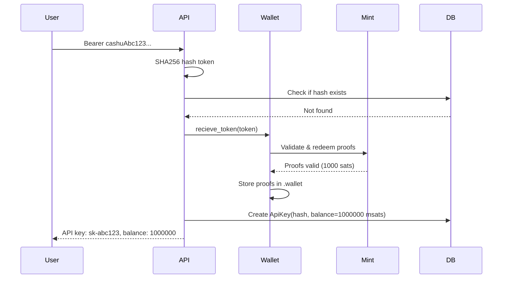
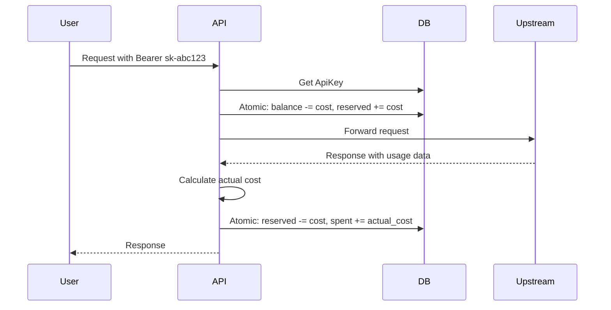
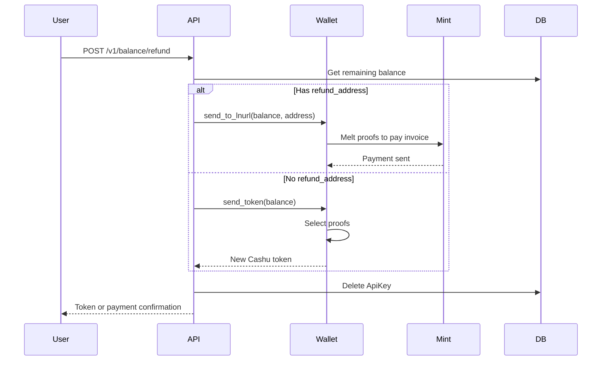

# Cashu Mint Integration Guide for Bitcoin Arcade Cabinet

## Executive Summary

This document reverse-engineers the Routstr proxy's Cashu mint integration to help you build a Bitcoin-powered arcade cabinet. The Routstr project uses Cashu eCash tokens for micropayments, managing user balances in a SQLite database while the actual Bitcoin value is held as Cashu proofs in a wallet.

**Key Insight for Arcade**: Instead of multiple users with individual balances, you'll have a single-player experience where users pay Lightning invoices to receive credits, play games, and potentially receive payouts for winning.

---

## Table of Contents

1. [How Cashu Works in Routstr](#how-cashu-works-in-routstr)
2. [Core Components](#core-components)
3. [Payment Flow Analysis](#payment-flow-analysis)
4. [Database Schema](#database-schema)
5. [Arcade Cabinet Adaptation](#arcade-cabinet-adaptation)
6. [Implementation Roadmap](#implementation-roadmap)
7. [Code Examples](#code-examples)
8. [Security Considerations](#security-considerations)

---

## How Cashu Works in Routstr

### Overview

Cashu is an eCash protocol built on Bitcoin Lightning Network. It provides:
- **Privacy**: Tokens are bearer instruments (like cash)
- **Instant transfers**: No on-chain confirmations needed
- **Micropayments**: Denominated in sats or msats
- **Interoperability**: Works with any Cashu mint

### Two-Layer Architecture

```
┌─────────────────────────────────────────────────────────┐
│                    Application Layer                     │
│  - User balances tracked in SQLite (millisatoshis)      │
│  - API keys map to balances                              │
│  - Spending tracked per request                          │
└─────────────────────────────────────────────────────────┘
                           ↕
┌─────────────────────────────────────────────────────────┐
│                     Cashu Wallet Layer                   │
│  - Actual Bitcoin value stored as Cashu proofs          │
│  - Proofs stored in .wallet directory                    │
│  - Communicates with Cashu mints via HTTP                │
└─────────────────────────────────────────────────────────┘
                           ↕
┌─────────────────────────────────────────────────────────┐
│                      Cashu Mint(s)                       │
│  - Holds actual Bitcoin in Lightning channels           │
│  - Issues/redeems eCash tokens                           │
│  - Handles Lightning payments                            │
└─────────────────────────────────────────────────────────┘
```

---

## Core Components

### 1. Wallet Management (`routstr/wallet.py`)

**Key Functions:**

#### `get_wallet(mint_url: str, unit: str = "sat", load: bool = True) -> Wallet`
- Creates/retrieves a Cashu wallet instance for a specific mint
- Wallets are cached in memory (`_wallets` dict)
- Each wallet stores proofs in `.wallet` directory

#### `recieve_token(token: str) -> tuple[int, str, str]`
- Accepts a Cashu token string (starts with "cashu")
- Validates and redeems the token
- Returns: (amount, unit, mint_url)
- If token is from untrusted mint, swaps to primary mint via Lightning

#### `send_token(amount: int, unit: str, mint_url: str | None = None) -> str`
- Creates a new Cashu token for the specified amount
- Selects proofs from wallet
- Returns serialized token string

#### `credit_balance(cashu_token: str, key: ApiKey, session: AsyncSession) -> int`
- Redeems a token and credits user's database balance
- Converts sats to msats if needed
- Updates ApiKey.balance in database

#### `send_to_lnurl(amount: int, unit: str, mint: str, address: str) -> int`
- Pays out to a Lightning address
- Used for refunds and withdrawals
- Handles LNURL protocol (user@domain.com format)

### 2. Authentication & Balance (`routstr/auth.py`)

#### `validate_bearer_key(bearer_key: str, session: AsyncSession, ...) -> ApiKey`
- Accepts two types of keys:
  - `sk-<hash>`: Existing API key (reusable)
  - `cashu<token>`: One-time Cashu token
- For Cashu tokens:
  1. Hashes the token (SHA256)
  2. Checks if already redeemed
  3. If new, creates ApiKey record and redeems token
  4. Credits balance to the key

#### `pay_for_request(key: ApiKey, cost_per_request: int, session: AsyncSession) -> int`
- Deducts cost from user balance
- Uses atomic SQL updates to prevent race conditions
- Moves balance to `reserved_balance` first
- Returns cost charged

#### `adjust_payment_for_tokens(key: ApiKey, response_data: dict, session: AsyncSession, deducted_max_cost: int) -> dict`
- Called after API request completes
- Calculates actual cost based on token usage
- Refunds difference if actual < reserved
- Finalizes payment by moving from reserved to spent

### 3. Database (`routstr/core/db.py`)

#### ApiKey Model
```python
class ApiKey(SQLModel, table=True):
    hashed_key: str              # Primary key (SHA256 of token or API key)
    balance: int                 # Available balance in msats
    reserved_balance: int        # Reserved for in-flight requests
    refund_address: str | None   # Lightning address for refunds
    key_expiry_time: int | None  # Unix timestamp for expiry
    total_spent: int             # Lifetime spending
    total_requests: int          # Request counter
    refund_mint_url: str | None  # Which mint to use for refunds
    refund_currency: str | None  # "sat" or "msat"
```

**Key Property:**
```python
@property
def total_balance(self) -> int:
    return self.balance - self.reserved_balance
```

### 4. Payment Endpoints (`routstr/balance.py`)

#### `POST /v1/balance/topup`
- Accepts Cashu token in request body
- Redeems token and adds to existing balance
- Returns amount credited in msats

#### `POST /v1/balance/refund`
- Withdraws remaining balance
- If `refund_address` set: pays to Lightning address
- Otherwise: returns new Cashu token
- Deletes the ApiKey after refund

#### `GET /v1/balance/info`
- Returns current balance and reserved amount
- Returns API key (sk-<hash>)

### 5. X-Cashu Header Support (`routstr/payment/x_cashu.py`)

**Per-Request Payment Flow:**

1. Client sends request with `X-Cashu: <token>` header
2. Server redeems token immediately
3. Forwards request to upstream API
4. Calculates actual cost from response
5. Returns change token in `X-Cashu` response header

**Key Functions:**

#### `x_cashu_handler(request, x_cashu_token, path, max_cost_for_model) -> Response`
- Redeems incoming token
- Forwards to upstream
- Handles refunds on errors

#### `send_refund(amount: int, unit: str, mint: str | None = None) -> str`
- Creates refund token
- Retries up to 3 times on failure

---

## Payment Flow Analysis

### Flow 1: Initial Token Redemption (Account Creation)



### Flow 2: Spending Balance (API Request)



### Flow 3: Refund/Withdrawal



---

## Database Schema

### SQLite Tables

**api_keys**
```sql
CREATE TABLE api_keys (
    hashed_key TEXT PRIMARY KEY,
    balance INTEGER DEFAULT 0,           -- millisatoshis
    reserved_balance INTEGER DEFAULT 0,  -- millisatoshis
    refund_address TEXT,                 -- Lightning address
    key_expiry_time INTEGER,             -- Unix timestamp
    total_spent INTEGER DEFAULT 0,       -- millisatoshis
    total_requests INTEGER DEFAULT 0,
    refund_mint_url TEXT,
    refund_currency TEXT                 -- "sat" or "msat"
);
```

**Cashu Wallet Storage**
- Stored in `.wallet` directory (SQLite database)
- Managed by cashu-py library
- Contains proofs, keysets, mint info

---

## Arcade Cabinet Adaptation

### Architecture for Single-Player Arcade

```
┌─────────────────────────────────────────────────────────┐
│                    Arcade Frontend                       │
│  - Game interface                                        │
│  - QR code display for payment                           │
│  - Credit counter                                        │
│  - Payout display                                        │
└─────────────────────────────────────────────────────────┘
                           ↕
┌─────────────────────────────────────────────────────────┐
│                  Arcade Backend (Python)                 │
│  - Session management (temporary keys)                   │
│  - Game state tracking                                   │
│  - Credit deduction per game                             │
│  - Win detection & payout logic                          │
└─────────────────────────────────────────────────────────┘
                           ↕
┌─────────────────────────────────────────────────────────┐
│                    Cashu Integration                     │
│  - Accept Lightning payments → credits                   │
│  - Track session balance                                 │
│  - Pay out winnings to Lightning address                 │
└─────────────────────────────────────────────────────────┘
```

### Key Differences from Routstr

| Aspect | Routstr | Arcade Cabinet |
|--------|---------|----------------|
| **Users** | Multiple persistent users | Single ephemeral session |
| **API Keys** | Long-lived, reusable | Temporary, session-based |
| **Payment In** | Cashu tokens via API | Lightning invoice QR code |
| **Payment Out** | Refund on demand | Automatic payout on win |
| **Balance** | Persistent across sessions | Cleared after session |
| **Pricing** | Per-token API usage | Per-game flat rate |

### Recommended Flow for Arcade

#### 1. Session Start (Player Inserts Credits)

```python
# Generate Lightning invoice for credits
async def start_arcade_session(num_credits: int) -> dict:
    """
    Create a new arcade session and generate payment invoice.
    
    Args:
        num_credits: Number of game credits to purchase
    
    Returns:
        {
            "session_id": "abc123",
            "invoice": "lnbc...",
            "amount_sats": 1000,
            "qr_code": "data:image/png;base64,...",
            "expiry": 1234567890
        }
    """
    # Calculate cost (e.g., 100 sats per credit)
    amount_sats = num_credits * 100
    
    # Request mint quote (Lightning invoice)
    wallet = await get_wallet(settings.primary_mint, "sat")
    mint_quote = await wallet.request_mint(amount_sats)
    
    # Create session in database
    session = ArcadeSession(
        session_id=generate_session_id(),
        credits=0,  # Will be credited after payment
        invoice=mint_quote.request,
        quote_id=mint_quote.quote,
        amount_sats=amount_sats,
        expiry=time.time() + 600  # 10 min expiry
    )
    db.add(session)
    await db.commit()
    
    return {
        "session_id": session.session_id,
        "invoice": mint_quote.request,
        "amount_sats": amount_sats,
        "qr_code": generate_qr_code(mint_quote.request),
        "expiry": session.expiry
    }
```

#### 2. Payment Confirmation (Background Polling)

```python
async def check_payment_status(session_id: str) -> dict:
    """
    Check if Lightning invoice has been paid.
    Poll this endpoint from frontend every 2 seconds.
    """
    session = await db.get(ArcadeSession, session_id)
    if not session:
        raise HTTPException(404, "Session not found")
    
    if session.credits > 0:
        return {"paid": True, "credits": session.credits}
    
    # Check if invoice was paid
    wallet = await get_wallet(settings.primary_mint, "sat")
    try:
        # Attempt to mint tokens (will succeed if invoice paid)
        await wallet.mint(session.amount_sats, quote_id=session.quote_id)
        
        # Credit the session
        session.credits = session.amount_sats // 100  # 100 sats per credit
        await db.commit()
        
        return {"paid": True, "credits": session.credits}
    except Exception as e:
        # Invoice not paid yet
        return {"paid": False, "credits": 0}
```

#### 3. Play Game (Deduct Credits)

```python
async def start_game(session_id: str) -> dict:
    """
    Deduct one credit and start a game.
    """
    session = await db.get(ArcadeSession, session_id)
    
    if session.credits < 1:
        raise HTTPException(402, "Insufficient credits")
    
    # Atomic deduction
    result = await db.execute(
        update(ArcadeSession)
        .where(ArcadeSession.session_id == session_id)
        .where(ArcadeSession.credits >= 1)
        .values(credits=ArcadeSession.credits - 1)
    )
    
    if result.rowcount == 0:
        raise HTTPException(402, "Insufficient credits")
    
    await db.commit()
    await db.refresh(session)
    
    return {
        "game_started": True,
        "credits_remaining": session.credits
    }
```

#### 4. Win Payout (Send Lightning Payment)

```python
async def process_win_payout(session_id: str, win_amount_sats: int, ln_address: str) -> dict:
    """
    Pay out winnings to player's Lightning address.
    
    Args:
        session_id: Current arcade session
        win_amount_sats: Amount won (in sats)
        ln_address: Player's Lightning address (user@domain.com)
    
    Returns:
        {
            "paid": True,
            "amount_sats": 500,
            "recipient": "player@getalby.com"
        }
    """
    wallet = await get_wallet(settings.primary_mint, "sat")
    
    # Get available proofs
    proofs = get_proofs_per_mint_and_unit(wallet, settings.primary_mint, "sat")
    
    # Select proofs for payout amount
    send_proofs, _ = await wallet.select_to_send(
        proofs, win_amount_sats, set_reserved=True, include_fees=False
    )
    
    # Send to Lightning address
    amount_received = await raw_send_to_lnurl(
        wallet, send_proofs, ln_address, "sat"
    )
    
    # Log the payout
    session = await db.get(ArcadeSession, session_id)
    session.total_winnings += win_amount_sats
    await db.commit()
    
    return {
        "paid": True,
        "amount_sats": amount_received,
        "recipient": ln_address
    }
```

#### 5. Session End (Refund Unused Credits)

```python
async def end_session(session_id: str, refund_address: str | None = None) -> dict:
    """
    End session and optionally refund unused credits.
    """
    session = await db.get(ArcadeSession, session_id)
    
    if session.credits == 0:
        await db.delete(session)
        await db.commit()
        return {"refunded": False, "credits": 0}
    
    refund_sats = session.credits * 100
    
    if refund_address:
        # Pay to Lightning address
        wallet = await get_wallet(settings.primary_mint, "sat")
        proofs = get_proofs_per_mint_and_unit(wallet, settings.primary_mint, "sat")
        send_proofs, _ = await wallet.select_to_send(proofs, refund_sats, set_reserved=True)
        
        await raw_send_to_lnurl(wallet, send_proofs, refund_address, "sat")
        
        result = {
            "refunded": True,
            "amount_sats": refund_sats,
            "recipient": refund_address
        }
    else:
        # Return Cashu token
        token = await send_token(refund_sats, "sat")
        result = {
            "refunded": True,
            "amount_sats": refund_sats,
            "token": token
        }
    
    await db.delete(session)
    await db.commit()
    
    return result
```

---

## Implementation Roadmap

### Phase 1: Basic Setup (Week 1)

- [ ] Install dependencies: `cashu`, `fastapi`, `sqlmodel`
- [ ] Configure Cashu mint URL (use public mint for testing)
- [ ] Initialize wallet and test minting/melting
- [ ] Create basic database schema for sessions

### Phase 2: Payment Integration (Week 2)

- [ ] Implement Lightning invoice generation
- [ ] Add payment polling mechanism
- [ ] Test full payment flow with real sats
- [ ] Add QR code generation for invoices

### Phase 3: Game Integration (Week 3)

- [ ] Implement credit deduction logic
- [ ] Add game state tracking
- [ ] Create session management endpoints
- [ ] Test concurrent game sessions

### Phase 4: Payout System (Week 4)

- [ ] Implement win detection
- [ ] Add Lightning address payout
- [ ] Test payout flow with small amounts
- [ ] Add payout history logging

### Phase 5: Polish & Security (Week 5)

- [ ] Add session expiry handling
- [ ] Implement rate limiting
- [ ] Add comprehensive error handling
- [ ] Security audit and testing
- [ ] Add monitoring and logging

---

## Code Examples

### Minimal Arcade Backend

```python
from fastapi import FastAPI, HTTPException
from cashu.wallet.wallet import Wallet
from sqlmodel import Field, SQLModel, create_engine, Session, select
import asyncio
import time

app = FastAPI()

# Database
class ArcadeSession(SQLModel, table=True):
    session_id: str = Field(primary_key=True)
    credits: int = Field(default=0)
    invoice: str
    quote_id: str
    amount_sats: int
    created_at: int = Field(default_factory=lambda: int(time.time()))
    total_winnings: int = Field(default=0)

engine = create_engine("sqlite:///arcade.db")
SQLModel.metadata.create_all(engine)

# Cashu wallet
MINT_URL = "https://mint.minibits.cash/Bitcoin"
_wallet = None

async def get_wallet():
    global _wallet
    if _wallet is None:
        _wallet = await Wallet.with_db(MINT_URL, db="arcade_wallet")
        await _wallet.load_mint()
    return _wallet

# Endpoints
@app.post("/session/create")
async def create_session(credits: int):
    """Generate invoice for credits purchase."""
    wallet = await get_wallet()
    amount_sats = credits * 100  # 100 sats per credit
    
    mint_quote = await wallet.request_mint(amount_sats)
    
    session = ArcadeSession(
        session_id=f"session_{int(time.time())}",
        invoice=mint_quote.request,
        quote_id=mint_quote.quote,
        amount_sats=amount_sats
    )
    
    with Session(engine) as db:
        db.add(session)
        db.commit()
    
    return {
        "session_id": session.session_id,
        "invoice": mint_quote.request,
        "amount_sats": amount_sats
    }

@app.get("/session/{session_id}/status")
async def check_status(session_id: str):
    """Check if payment received and credits available."""
    with Session(engine) as db:
        session = db.get(ArcadeSession, session_id)
        if not session:
            raise HTTPException(404, "Session not found")
        
        if session.credits > 0:
            return {"paid": True, "credits": session.credits}
        
        # Try to mint
        wallet = await get_wallet()
        try:
            await wallet.mint(session.amount_sats, quote_id=session.quote_id)
            session.credits = session.amount_sats // 100
            db.add(session)
            db.commit()
            return {"paid": True, "credits": session.credits}
        except:
            return {"paid": False, "credits": 0}

@app.post("/game/start")
async def start_game(session_id: str):
    """Deduct one credit and start game."""
    with Session(engine) as db:
        session = db.get(ArcadeSession, session_id)
        if not session or session.credits < 1:
            raise HTTPException(402, "Insufficient credits")
        
        session.credits -= 1
        db.add(session)
        db.commit()
        
        return {"game_started": True, "credits_remaining": session.credits}

@app.post("/game/win")
async def process_win(session_id: str, amount_sats: int, ln_address: str):
    """Pay out winnings to Lightning address."""
    from routstr.payment.lnurl import raw_send_to_lnurl
    from routstr.wallet import get_proofs_per_mint_and_unit
    
    wallet = await get_wallet()
    proofs = get_proofs_per_mint_and_unit(wallet, MINT_URL, "sat", not_reserved=True)
    
    send_proofs, _ = await wallet.select_to_send(proofs, amount_sats, set_reserved=True)
    
    await raw_send_to_lnurl(wallet, send_proofs, ln_address, "sat")
    
    with Session(engine) as db:
        session = db.get(ArcadeSession, session_id)
        session.total_winnings += amount_sats
        db.add(session)
        db.commit()
    
    return {"paid": True, "amount_sats": amount_sats}
```

---

## Security Considerations

### 1. Wallet Security

**Risk**: Cashu wallet holds actual Bitcoin value
**Mitigation**:
- Store `.wallet` directory with restricted permissions (chmod 600)
- Regular backups of wallet database
- Consider hardware security module (HSM) for production
- Implement spending limits per session

### 2. Session Management

**Risk**: Session hijacking or replay attacks
**Mitigation**:
- Use cryptographically secure session IDs
- Implement session expiry (10-15 minutes)
- Clear expired sessions regularly
- Rate limit session creation

### 3. Payout Validation

**Risk**: Fraudulent win claims
**Mitigation**:
- Verify game results server-side (never trust client)
- Implement maximum payout limits
- Log all payouts for audit trail
- Add manual review for large payouts

### 4. Lightning Address Validation

**Risk**: Invalid or malicious Lightning addresses
**Mitigation**:
- Validate LNURL format before payment
- Test with small amount first
- Handle payment failures gracefully
- Add address whitelist for testing

### 5. Mint Trust

**Risk**: Mint operator could rug pull
**Mitigation**:
- Use multiple trusted mints
- Keep minimal balance in hot wallet
- Regular payouts to cold storage
- Monitor mint health/reputation

### 6. Database Integrity

**Risk**: Balance manipulation via SQL injection
**Mitigation**:
- Use parameterized queries (SQLModel handles this)
- Atomic updates for balance changes
- Regular database backups
- Audit logs for all transactions

---

## Additional Resources

### Cashu Documentation
- **Protocol Spec**: https://github.com/cashubtc/nuts
- **Python Library**: https://github.com/cashubtc/cashu
- **Mint List**: https://github.com/cashubtc/cashu/wiki/Mints

### Lightning Network
- **LNURL Spec**: https://github.com/lnurl/luds
- **Lightning Address**: https://lightningaddress.com/

### Testing Mints
- **Minibits**: https://mint.minibits.cash/Bitcoin
- **Legend**: https://legend.lnbits.com/cashu/api/v1/4gr9Xcmz3XEkUNwiBiQGoC

### Routstr Project
- **GitHub**: https://github.com/routstr/routstr-core
- **Documentation**: Check `/docs` directory in repo

---

## Conclusion

The Routstr project provides a solid foundation for integrating Cashu eCash into your arcade cabinet. The key components you need are:

1. **Cashu Wallet** - Manages Bitcoin value as eCash proofs
2. **Database** - Tracks session credits and spending
3. **Lightning Integration** - Accepts payments and sends payouts
4. **Session Management** - Temporary user accounts per play session

By adapting the Routstr codebase, you can create a Bitcoin-powered arcade that:
- Accepts Lightning payments for credits
- Tracks player balance during session
- Pays out winnings to Lightning addresses
- Provides a seamless, privacy-preserving experience

The main simplification for your use case is removing multi-user complexity and focusing on ephemeral single-player sessions with automatic cleanup.

**Next Steps**: Start with Phase 1 of the implementation roadmap, test with small amounts on testnet/signet, and gradually build out the full feature set.
